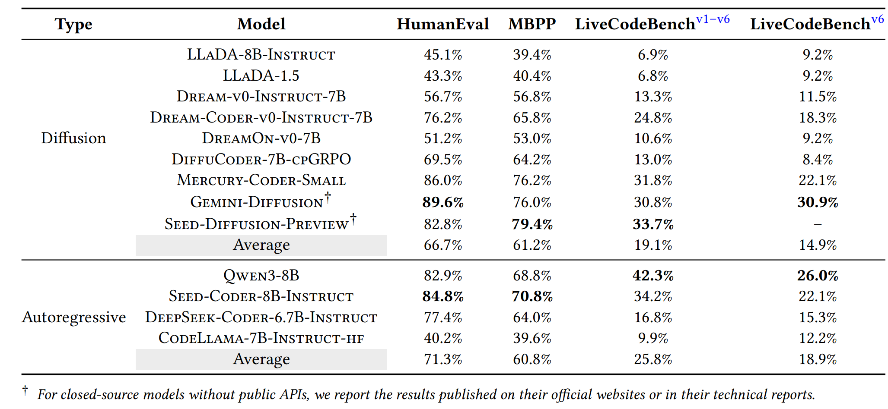

# Diffusion LLMs For Code Generation
Offical implementation of our paper "Exploring the Potential of Diffusion Large Language Models in Code Generation".
<p align="center">
    <a href="https://www.python.org/">
        
    </a>
    <a href="https://copyright.princeton.edu/policy">
        
    </a>
</p>


## 📰 News
* **[Sep, 2025]**: We've released the code for our paper "Exploring the Potential of Diffusion Large Language Models in Code Generation"
## 👋 Overview
Our work is an empirical study on exploring the potential of Diffusion LLMs in Code Generation


As an emerging model architecture, Diffusion LLMs have achieved performance levels comparable to those of Autoregressive LLMs, and in some cases, even surpass them.


## 🚀 Environment Setup  
To conduct tests on [HumanEval](https://github.com/openai/human-eval) and [MBPP](https://github.com/google-research/google-research/tree/master/mbpp), execute the following command:  
```bash
pip install -r requirements.txt
```  

For testing on [LiveCodeBench](https://github.com/LiveCodeBench/LiveCodeBench), first configure the environment as specified in its official repository. Then, within the established Python environment, run:  
```bash
pip install -r requirements_LiveCodeBench.txt
```  

For [RepoQA](https://github.com/evalplus/repoqa/), first set up the environment following the instructions in its official repository. Subsequently, replace the file `repoqa/provider/hf.py` (from the official RepoQA repository) with the counterpart provided in our repository, located at `RepoQA/utils/hf.py`.  

Please note that conflicts may arise between different environments. Plase create separate, independent environments for each benchmark. You may refer to **Conda** (a popular package/environment manager) or **UV** (a fast Python package/environment tool) to streamline environment isolation.
## 💽 Usage
For [HumanEval](https://github.com/openai/human-eval), [MBPP](https://github.com/google-research/google-research/tree/master/mbpp), and [LiveCodeBench](https://github.com/LiveCodeBench/LiveCodeBench), simply locate the model you wish to run and execute the corresponding command:  

```python
python HumanEval/humaneval_dreamCoder.py  # For HumanEval
python mbpp_mercury.py  # For MBPP
python LiveCodeBench/Livecb_llada_1_5.py  # For LiveCodeBench
```  

The hyperparameters are specified in the file, you may locate and modify them as needed.

For [RepoQA](https://github.com/evalplus/repoqa/), testing Diffusion LLMs follows the same procedure as testing Autoregressive LLMs. Specifically:  

```python
# For Hugging Face Models
repoqa.search_needle_function --model "Dream-org/Dream-Coder-v0-Instruct-7B" --backend hf --code-context-size 2048 --trust-remote-code

# For Models with Available API
OPENAI_BASE_URL=https://api.inceptionlabs.ai/v1 \ 
OPENAI_API_KEY=<your_api_key> \
repoqa.search_needle_function --model "merucry-coder" --backend openai --code-context-size 16384
```  
## ✍️ Citation & license
MIT license.

If you find our work helpful, please use the following citations.

```bibtex
Under review, not shown
```
